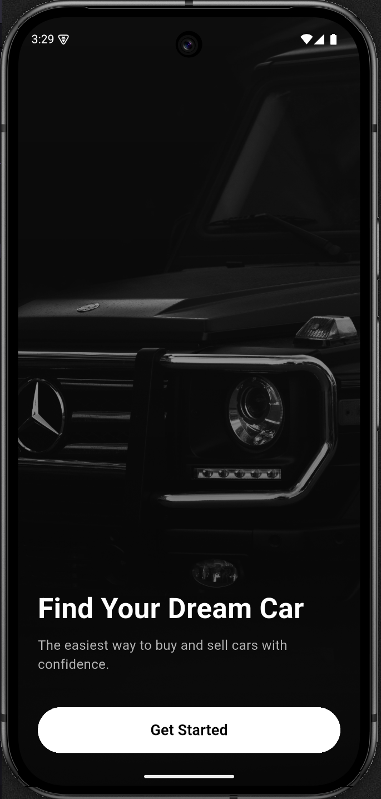
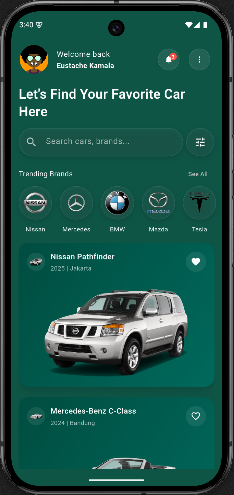
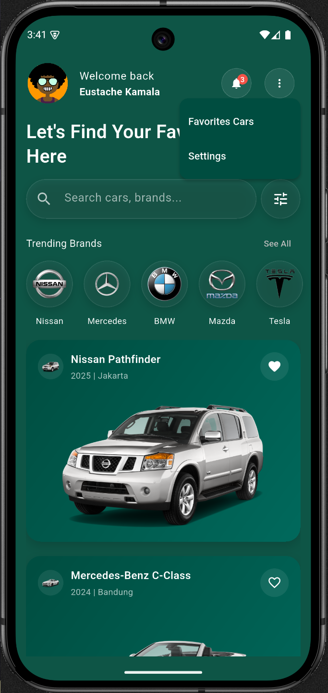
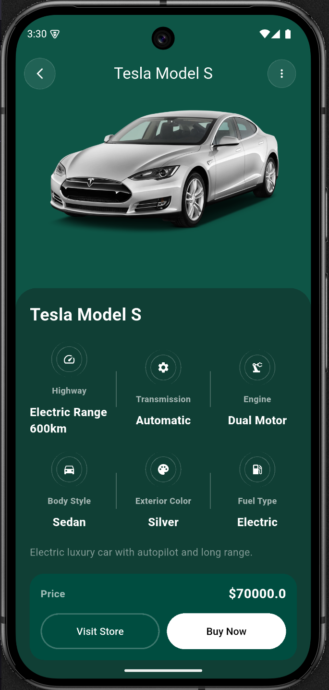
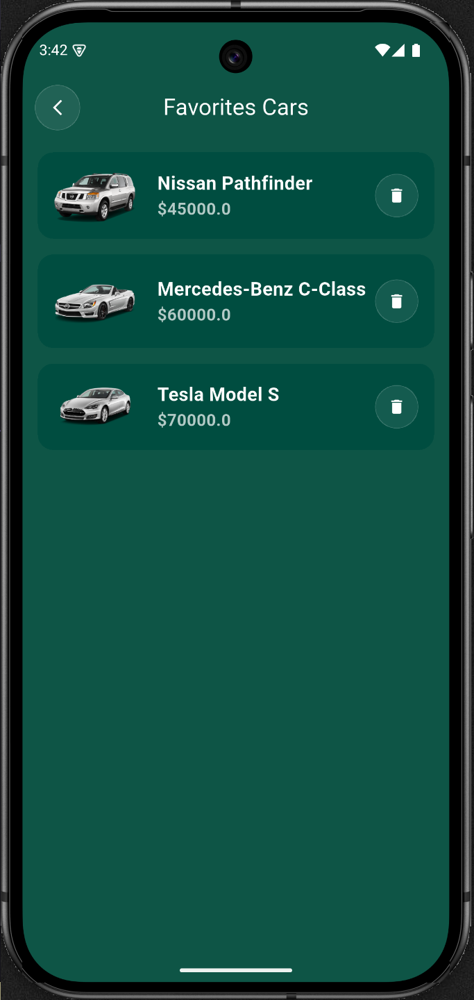
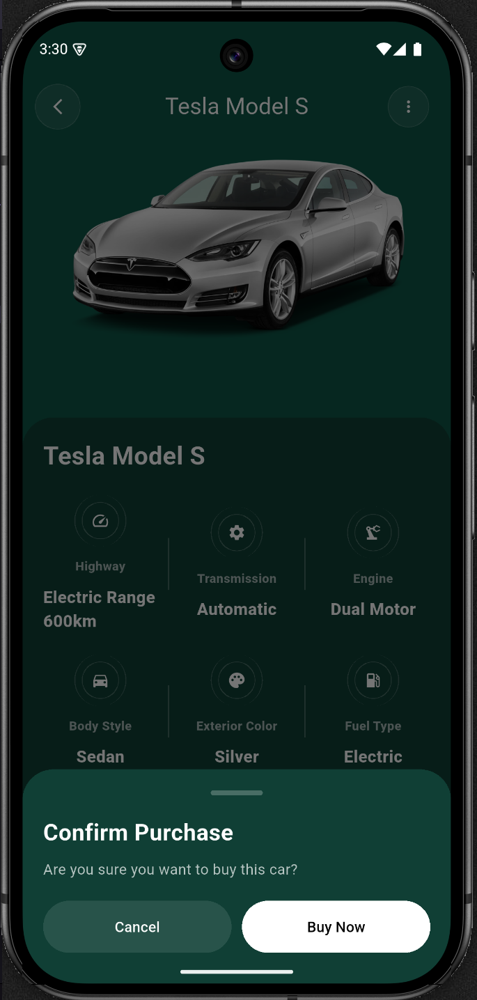
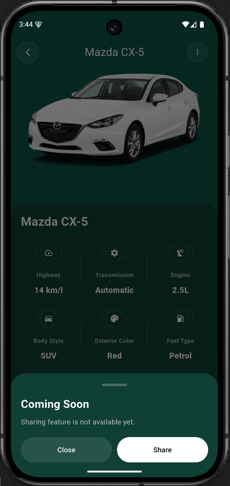

# Car Marketplace

A modern Flutter application showcasing a clean and scalable car marketplace UI.

---

## Features

- Browse car listings with brand badges and images  
- View detailed car information (engine, transmission, fuel, color, etc.)  
- Search and filter cars from local assets  
- Clean, reusable widgets (cards, badges, detail components)  
- Modern UI with smooth interactions  

---

## Application Preview

  
  
  
  
  
  
  

---

## Tech Stack

- Flutter (Dart)
- Material UI
- Local asset-based data (ready for API integration)

---

## Future Improvements

- API integration (dynamic car data)
- Favorites / Wishlist feature
- Checkout & payment flow
- Dark mode improvements
- Advanced filtering (price, brand, fuel type)

## Author

Eustache Kamala

Flutter Developer | Full-Stack Enthusiast
